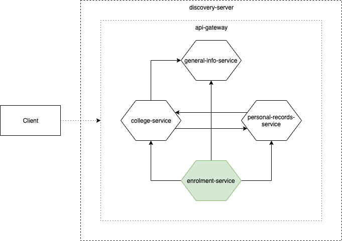

# 1. Overview
The enroment service is the system of which students enroll to offerings provided by the colleges.

This service uses [genuniv-common-service](https://github.com/carzanodev/genuniv-common-service) as its chassis.

# 2. Access Endpoints
1. `/api/v1/enrolment`

# 3. Data Dependencies
The enrolment service requests data from the following services via its APIs:
1. [general-info-service](https://github.com/carzanodev/genuniv-general-info-service)
    * School Year
    * School Period
    * Schedule
2. [college-service](https://github.com/carzanodev/genuniv-college-service)
    * Offering
2. [personal-records-service](https://github.com/carzanodev/genuniv-personal-records-service)
    * Faculty
    * Student
    * Staff
    
The retrieval of the data are done via a dedicated thread that periodically requests from the APIs. The data are also being cached afterwards.